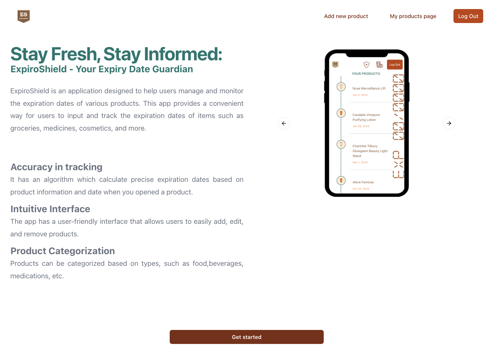

### 🪐 Welcome to my corner of the coding universe

I'm a friendly psychologist turned web developer, having traded couches for keyboards and analysis for algorithms.

Fresh off completing full-stack bootcamp, I'm diving into an exciting journey where newly-gained coding skills meet real-world experiences.

### ⚙️ Things I code with

- **Languages:** TypeScript, JavaScript
- **Front-End Development:** HTML, CSS, React.js, Next.js.
- **Back-End Development:** Express.js, SQLite, Prisma.

### ⭐️ The project I have worked on a lot

**ExpiroShield**

**The main goal of the application** is to help users in tracking and organizing the expiration dates of different products.

**Features**:

- **Chronological Timeline:** Displays products in chronological order, highlighting expiration dates from soonest to newest.

- **Advanced Expiry Calculation:** Calculates precise expiration dates based on product details and the opening date.

- **Efficient Product Management:** Easily add, edit, and delete product information. The system automatically generates individual pages for each product, allowing users to upload photos, provide descriptions, select categories, and assign importance.

- **Expiration Status Sections:** Includes an archive for expired products and a "About to Expire" section, providing quick access to products that will expire in the next two weeks. Keep your inventory organized and stay ahead of expirations.

- **Responsive design:** Enjoy seamless usage on any device. The interface adapts to different screen sizes for a user-friendly experience across devices.

**Tech Stack:**
Frontend: Next.js, React, TypeScript. 
Backend: Prisma ORM, Express. 
Styling: Tailwind CSS, Shadcn.

### 📬 Reach me at <a href="www.linkedin.com/in/alena-moskaeva">LinkedIn</a>&nbsp;&nbsp;&nbsp;&nbsp;
